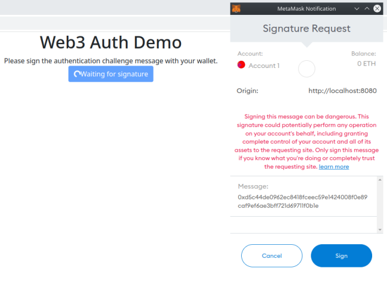
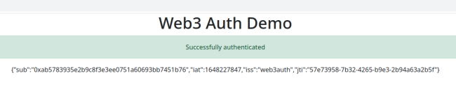

# Web3auth Demo

## About
This is a proof-of-concept implementation for a client-server authentication flow leveraging cryptographic functions of a Web3 wallet in the browser to authenticate a client, enabling user identification without any user database. The client is authenticated by their wallet public key/address.

See below for a more detailed flow documentation.

Technically, this is made with:
* a REST backend using Spring Boot, Web3j, and JJWT (for JWS functionality), written in Kotlin
* a Web frontend using Web3.js and a custom React.js component, written in JavaScript

## Authentication flow documentation

1. The authentication flow starts with the client connecting their Web3 wallet (for example MetaMask)
2. The client then requests a challenge for the wallet address from the backend. The backend responds with a nonce associated with the given address.
3. The client signs the nonce (to be precise: the sha3 hash of the nonce, see [here](https://github.com/MetaMask/providers/issues/199) why) and sends the response to the backend
4. The backend validates the signature and checks for matching nonce / signing address and challenged address. On success, a JWS for the address is returned
5. The client receives the JWS. In this PoC, the payload is simply presented to the user

## How to run
Start the main function in `Web3authApplication` to run the backend, then navigate to http://localhost:8080 to start the authentication flow. You must have a Web3 wallet installed in your browser, for example [MetaMask](https://metamask.io/).

## Deployment Details

This is a PoC, not a production ready system. Keep the following deployment details in mind:

* A simple Map instance is used in the backend to store the nonces, so the application should not be run with multiple instances. In production, a distributed k/v store must be used
* Also, there are no timeouts for the challenge. This is not a real security weakness, but timeouts should be used in production
* The challenge is not signed by the backend. This should not be a security weakness, too, because the challenge is associated with its address in the backend. Also, you should only communicate using https in production anyway, so there is no need for signing the client-server flow
* The keypair used to sign the JWS is regenerated at each server start. Use a central keystore in production. (Note: There is a fixed keypair used for unit tests)
* It would be advisable to rate limit the response endpoint to avoid a possible (albeit very theoretical) DOS attack vector

## Implementation Details

### Backend
* The address data type is validated in the boundary only, and stringly typed in the domain services. This is fine, because that way no invalid addresses can occur in the domain services at all
* The backend uses [Zalando Problem](https://github.com/zalando/problem) for reporting errors as `application/problem+json`

### Frontend
* The frontend does not validate the JWS
* Because this is a development prototype, Babel.js and development versions of React are used
* Error reporting is done very rudimentary via `alert`

### Swagger UI for REST endpoints
The backend runs Swagger UI for easy access to the endpoints and their OpenAPI documentation, see http://localhost:8080/swagger-ui/index.html
